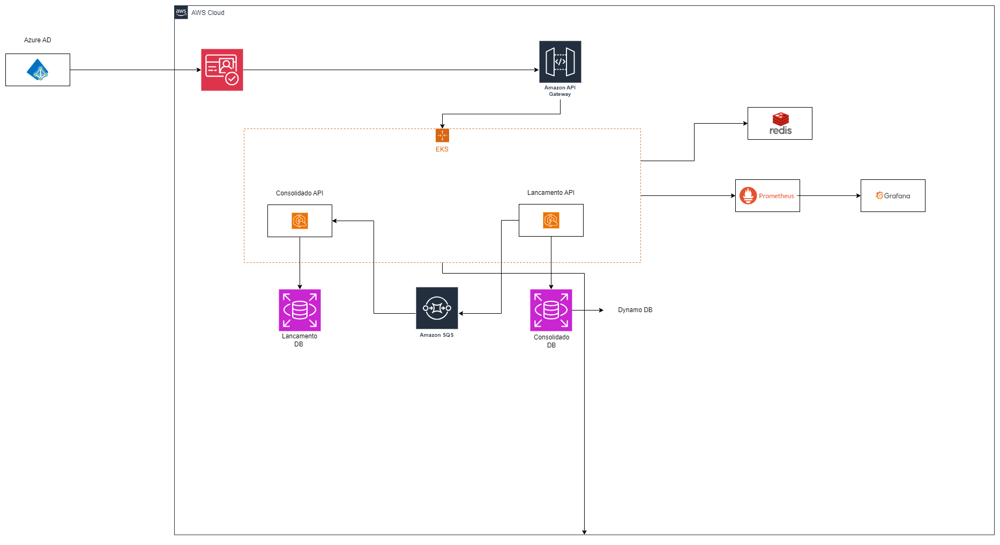
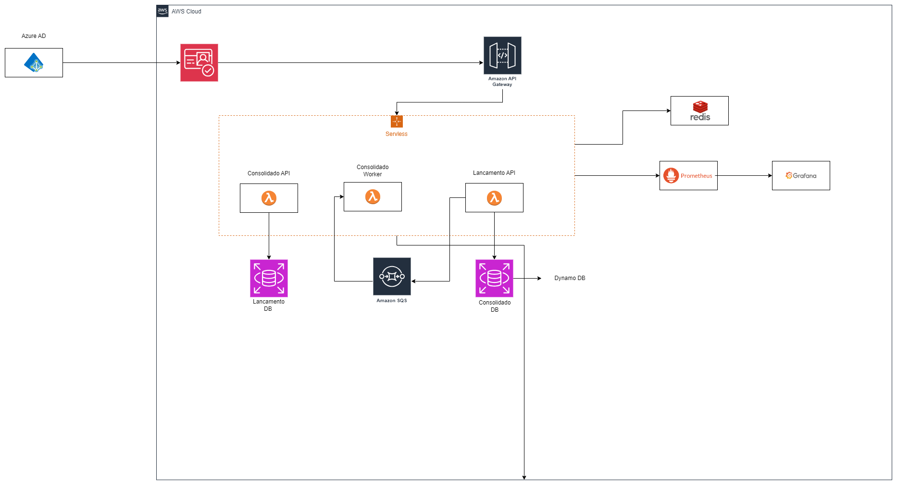

# Desafio de Arquitetura de Software para Fluxo de Caixa

## Executando a Aplicação 🚀

Para facilitar a execução do projeto, incluímos um script automatizado. Basta seguir os passos abaixo:

1. **Certifique-se de que todas as dependências estão instaladas** (Docker, .NET SDK, PostgreSQL, Redis, etc.).
2. **Abra o terminal na raiz do projeto**.
3. **Execute o seguinte comando**:

   ```sh
   run.cmd

## Banco de Dados e Mensageria 📊📩

Para facilitar a execução local e garantir um desenvolvimento mais ágil, todos os microserviços utilizam o **SQL Server Express** como banco de dados. Essa escolha permite uma configuração simplificada e um ambiente unificado para testes e validação da aplicação.

Além disso, para atender aos requisitos do desafio e simular um ambiente assíncrono, foi utilizado o **Kafka** como sistema de mensageria. No ambiente real, a solução utilizaria o **Amazon SQS**, mas o Kafka foi escolhido para a versão local devido à facilidade de configuração e redução de custos no desenvolvimento. Isso garante que a solução possa ser testada de forma fiel ao comportamento esperado em produção. 🚀


## Introdução
Para atender aos requisitos do desafio de desenvolver uma arquitetura de software escalável e resiliente para controlar lançamentos de débito e crédito e gerar o consolidado diário de um fluxo de caixa, foram propostas duas soluções baseadas em princípios modernos de arquitetura.

## Diagrama da Solução Micro Serviços




## Solução 1: Arquitetura Baseada em Microserviços
A primeira solução foi baseada em microsserviços utilizando Amazon EKS, garantindo alta disponibilidade, escalabilidade e resiliência da aplicação, mesmo sob picos de carga e falhas de componentes. Utilizando as melhores práticas de arquitetura, como CQRS (Command Query Responsibility Segregation), Event-Driven Architecture e padrões de resiliência como Circuit Breaker e Idempotência, essa solução assegura que o sistema possa processar 50 requisições por segundo para o consolidado diário com alta performance e baixo custo operacional.

### Estrutura da Solução
- **Arquitetura baseada em Microserviços**
- Dois microsserviços principais: um para o controle de lançamentos de débitos e créditos e outro para a consolidação diária dos lançamentos.
- Um worker para processar os lançamentos que não puderam ser processados devido a alguma falha na API de consolidação.
- Cada microsserviço possui uma responsabilidade única e um banco de dados próprio, garantindo isolamento de falhas.

### Padrões Arquiteturais Utilizados
- **CQRS:** Separando operações de leitura e escrita para otimizar o desempenho.
- **Dependency Injection (DI):** Facilitando a manutenção e o desacoplamento do código.
- **Repository Pattern:** Abstraindo a persistência de dados para desacoplar a lógica de negócios da infraestrutura de dados.
- **Event-Driven Architecture:** Facilitando a comunicação assíncrona entre microsserviços, publicando eventos de lançamento e consolidando-os.
- **Cache-aside Pattern:** Reduzindo redundância e otimizando consultas verificando se uma mensagem já foi processada.

### Resiliência e Comunicação
- **Circuit Breaker:** Protegendo o sistema contra falhas repetidas e evitando sobrecarga.
- **Idempotência e Redis:** Previnindo o reprocessamento de eventos, garantindo que a lógica de processamento seja correta e eficiente.

### Uso de Mensageria para Comunicação Assíncrona
- **Kafka:** Garante a entrega de mensagens entre os microsserviços com baixo custo e alto desempenho.

### Armazenamento e Banco de Dados
- **DynamoDB para a API de Consolidação Diária:** Banco NoSQL altamente escalável e gerenciado pela AWS.
- **RDS (PostgreSQL) para a API de Lançamento:** Banco relacional com alta disponibilidade e escalabilidade.

### Monitoramento e Observabilidade
- **CloudWatch:** Monitoramento de logs e métricas.
- **Prometheus & Grafana:** Coleta e visualização de métricas em tempo real.

### API Gateway e Segurança
- **API Gateway:** Centraliza autenticação, autorização, monitoração e oferece proteção contra DDoS.
- **Autenticação e Autorização:** Uso de Azure AD e Amazon Cognito para gestão de identidades.

---

## Solução 2: AWS Lambda e Step Functions
Uma melhoria significativa pode ser implementada utilizando **AWS Lambda com AWS Step Functions**, substituindo os microsserviços em EKS. Essa abordagem proporciona uma arquitetura mais simples, eficiente e econômica, sem a necessidade de gerenciar infraestrutura de containers ou clusters Kubernetes.

## Diagrama da Solução Servless



### Estrutura da Solução
- **Arquitetura baseada em AWS Lambda e Step Functions**
- Substituição dos microsserviços em EKS por funções Lambda, coordenadas pelo AWS Step Functions.
- Cada função Lambda será responsável por uma unidade de trabalho, garantindo modularidade e fácil manutenção.

### Padrões Arquiteturais Utilizados
- **CQRS:** Mantém a separação entre operações de leitura e escrita.
- **Event-Driven Architecture:** Integração de AWS Lambda com Step Functions para fluxos assíncronos.
- **Repository Pattern:** Mantém a abstração da persistência de dados com DynamoDB e RDS.

### Resiliência e Comunicação
- **Lambda + Step Functions:** Fluxos de trabalho coordenados com gerenciamento automático de falhas.
- **Idempotência e Redis:** Controle sobre eventos processados para evitar duplicidade.

### Uso de AWS Step Functions para Orquestração
- **Orquestração Visual:** Interface gráfica para desenhar fluxos de trabalho.

### Escalabilidade e Infraestrutura
- **Escalabilidade Automática:** AWS Lambda ajusta automaticamente a capacidade conforme a carga.
- **Custo Efetivo:** Pagamento apenas pelo tempo de execução das funções.

### Monitoramento e Observabilidade
- **CloudWatch:** Monitoramento de logs e métricas.
- **AWS X-Ray:** Rastreio detalhado das funções Lambda.

### API Gateway e Segurança
- **API Gateway:** Gerenciamento de endpoints para funções Lambda.
- **Autenticação e Autorização:** Uso de Cognito para gestão de identidades.

### Melhorias Propostas
- **Menor Complexidade Operacional:** Eliminando a necessidade de gerenciar containers.
- **Escalabilidade Automática:** Funções Lambda escalam automaticamente.
- **Custo Efetivo:** Redução de custos operacionais.
- **Monitoramento Simplificado:** Integração com CloudWatch e AWS X-Ray.

## Considerações Finais
A solução com AWS Lambda e Step Functions representa uma melhoria significativa, oferecendo uma arquitetura mais ágil, escalável e com custos reduzidos. Ambas as abordagens atendem aos requisitos do desafio com alto desempenho e alta disponibilidade, permitindo flexibilidade na escolha da melhor arquitetura para cada cenário.

## 📌 Serviços Utilizados

### 🗄️ Banco de Dados: SQL Server Express
- **Imagem:** `mcr.microsoft.com/mssql/server:2019-latest`
- **Motivo:** Banco de dados relacional para armazenamento das informações da aplicação.
- **Volumes:** Persistência de dados evitando perda ao reiniciar o container.
- **Porta:** `1433:1433` (porta padrão do SQL Server).

### 📊 Monitoramento e Observabilidade: Prometheus e Grafana
- **Prometheus:**
  - **Imagem:** `prom/prometheus`
  - **Motivo:** Coleta métricas de desempenho e saúde da aplicação.
  - **Volumes:** `prometheus.yml` (configuração para coleta de métricas).
  - **Porta:** `9090` (interface web para consulta de métricas).
  
- **Grafana:**
  - **Imagem:** `grafana/grafana`
  - **Motivo:** Dashboards interativos para visualizar métricas coletadas pelo Prometheus.
  - **Volumes:** Dashboards e provisionamento de configurações.
  - **Porta:** `3000` (interface gráfica de monitoramento).

### 🏗️ Microsserviços
Os seguintes microsserviços foram implementados como Web APIs:
- **`carrefour_user_webapi`**: Gerencia usuários e autenticação.
- **`carrefour_lancamento_webapi`**: Registra lançamentos de crédito/débito.
- **`carrefour_consolidado_webapi`**: Consolida transações diárias.

Cada serviço:
- Tem seu próprio Dockerfile (`build.context`).
- Está configurado para rodar nas portas HTTP (`8080`) e HTTPS (`8081`), mapeadas para diferentes portas para evitar conflitos (`9098`, `19098`, `29098`).
- Compartilha volumes de secrets e certificados (`usersecrets`, `https`).

### 🔄 Processamento Assíncrono: Worker para Consolidação
- **Container:** `carrefour_consolidado_worker`
- **Motivo:** Processa transações de forma assíncrona.
- **Depende de:** Kafka (para mensageria) e Redis (para caching e controle de idempotência).

### 📬 Mensageria: Kafka e Redis
- **Kafka:** Garante comunicação assíncrona e processamento distribuído.
  - **Depende do Zookeeper** (gerencia os brokers).
  - **Porta:** `9092` (acesso ao broker).
- **Redis:** Armazena dados temporários, evitando processamento duplicado.
  - **Porta:** `6379`.

### 🖥️ Interface para Kafka: Kafka UI
- **Motivo:** Permite visualizar mensagens no Kafka.
- **Porta:** `8082` (acesso via navegador).

### 🔧 Gerenciamento de Containers: Portainer
- **Motivo:** Facilita a administração dos containers via interface web.
- **Porta:** `9000`.

---

## 🌐 Rede e Comunicação
- Todos os serviços compartilham a rede `monitoring`, garantindo comunicação interna segura.

## 💾 Volumes Persistentes
- SQL Server, Portainer e Grafana utilizam volumes para evitar perda de dados entre reinicializações.

Essa estrutura fornece um ambiente completo para desenvolvimento e testes, simulando uma arquitetura real com **banco de dados, microsserviços, processamento assíncrono e monitoramento**. 🚀

